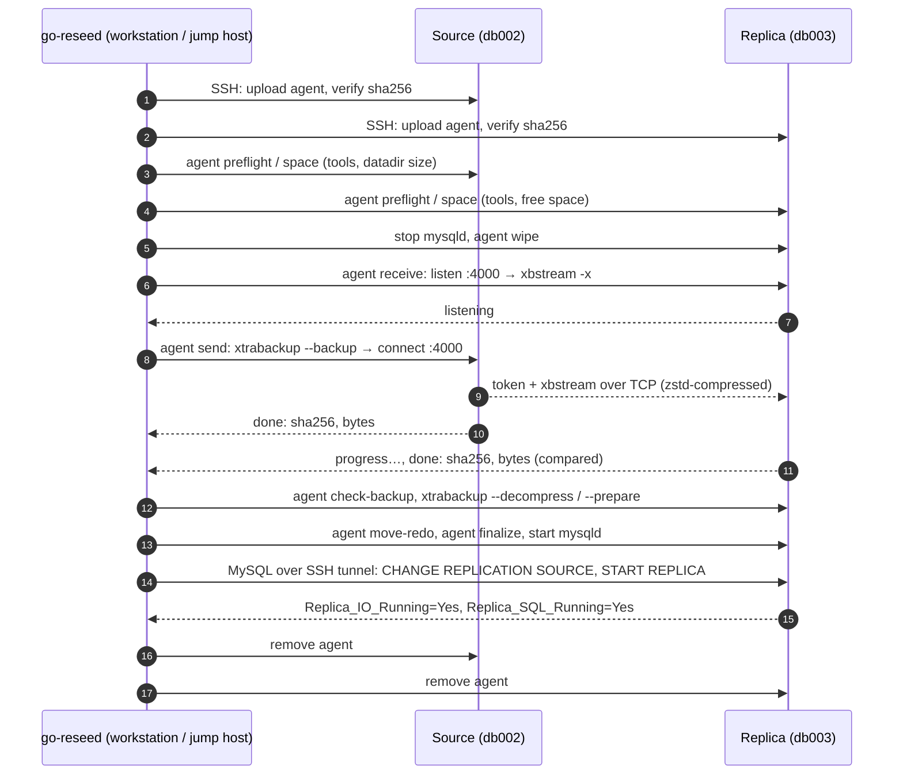

# go-reseed

**Rebuild a MySQL 8.0 replica from a live source with one command.**

`go-reseed` streams a [Percona XtraBackup 8.0](https://docs.percona.com/percona-xtrabackup/8.0/)
backup from a source straight into a replica's datadir. It then prepares the backup, restarts
mysqld, and configures replication, checking each step along the way. It replaces the
`db_reseed-innobackupex.yml` Ansible playbook with a single static Go binary. There's nothing to
install on the database hosts beyond XtraBackup: go-reseed uploads itself as a temporary agent,
does the work in Go, and removes itself when it's done.

```text
$ go-reseed --source db002 --replica db003 --datadir /db/data01 --logdir /db/logs01 --service mysql

This will run stop, wipe, stream on db003, DESTROYING everything in /db/data01 and /db/logs01,
and rebuild it from db002:/db/data01.

Type the replica host name to continue: db003
==> deploying the go-reseed agent
    agent on db002: /tmp/go-reseed-agent.k3Jd9Q (linux/amd64, sha256 80ae6c73f29e…)
    agent on db003: /tmp/go-reseed-agent.Pq7xZ2 (linux/amd64, sha256 80ae6c73f29e…)
==> [1/10] preflight: check tools, directories and disk space on both hosts
    source datadir 212.4 GiB, replica space available 480.0 GiB
    done in 2s
==> [2/10] stop: stop mysqld on the replica
==> [3/10] wipe: empty the replica's datadir (and logdir)
==> [4/10] stream: stream xtrabackup from source into the replica's datadir
    12.1 GiB received (98.4 MiB/s)
    ...
    41.3 GiB streamed; sha256 49c6124b…5723e matches on both hosts
    done in 41m12s
    ...
==> [10/10] replication: point the replica at the source and start replication
    backup position: binlog.000812:4711 gtid="3e11fa47-...:1-9123344"
    replica MySQL 8.0.39, gtid_mode=ON
    sql> STOP REPLICA
    sql> RESET REPLICA ALL
    sql> RESET MASTER
    sql> SET GLOBAL gtid_purged = ?
    sql> CHANGE REPLICATION SOURCE TO SOURCE_HOST = ?, ... SOURCE_AUTO_POSITION = 1
    sql> START REPLICA
    replication running, 0s behind source
```

(The session above is illustrative; your sizes, timings and positions will differ.)

---

## Contents

- [Features](#features)
- [How it works](#how-it-works)
- [Quick start](#quick-start)
- [Installation](#installation)
- [Usage](#usage)
- [Steps](#steps)
- [Flags](#flags)
- [Dependencies](#dependencies)
- [Prerequisites and setup](#prerequisites-and-setup)
- [Safety features](#safety-features)
- [Troubleshooting](#troubleshooting)
- [Compared with the Ansible playbook](#compared-with-the-ansible-playbook)
- [Testing](#testing)
- [Test lab](#test-lab)
- [Development](#development)

---

## Features

- **Go on the hosts, not shell.** go-reseed uploads its own binary to each host as a short-lived
  agent (checked by SHA-256 after upload, deleted afterwards). The agent streams, checksums, wipes,
  moves and chowns with the Go standard library. The only programs it runs are XtraBackup's own.
- **Direct streaming.** The backup goes from the source to the replica over TCP and never lands on
  the source's disk or passes through the machine running `go-reseed`. A one-time token keeps
  stray connections out of the stream.
- **Checksums on both ends.** Both agents SHA-256 the stream and count its bytes, and the run
  fails if either differs.
- **Clean interrupts.** Press Ctrl-C mid-stream and both agents stop `xtrabackup`/`xbstream` and
  remove themselves. Nothing keeps running on the hosts.
- **GTID or file/position.** The replication step reads `gtid_mode` on the replica and uses
  `SOURCE_AUTO_POSITION=1` when it's on and the binlog file and position otherwise.
- **Version-aware SQL.** It uses `CHANGE REPLICATION SOURCE TO` on MySQL 8.0.23+ and
  `CHANGE MASTER TO` on older 8.0 releases.
- **Resumable.** The run is split into ten named steps. If one fails, fix the problem and resume
  with `--from-step`.
- **Dry run.** `--dry-run` prints every command, agent operation and SQL statement without
  connecting to anything.
- **No database port exposure.** The MySQL connection to the replica goes through the existing SSH
  connection, so port 3306 doesn't need to be reachable from your workstation.
- **Guard rails.** It asks you to type the replica's host name before anything destructive runs,
  refuses to wipe while mysqld is running (checked two ways), rejects dangerous paths, and checks
  tools and disk space before anything is stopped.
- **Single binary.** Pure Go with no cgo. Cross-compiles for Linux and macOS on amd64 and arm64.

## How it works



**The agent.** `go-reseed agent <op>` is a hidden subcommand of the same binary. At the start of a
run, go-reseed checks each host's CPU (`uname -m`), uploads the matching Linux build
(`go-reseed-linux-amd64` or `-arm64`) to a private temp file in `--agent-dir`, runs
`<agent> agent version` to confirm that the uploaded file's SHA-256 and protocol version match, and
deletes it when the run ends, whether it succeeded, failed or was interrupted. Every op runs as
root through `sudo -n` and reports JSON on stdout:

| Agent op | Does, in Go |
|----------|-------------|
| `preflight` | `exec.LookPath` for each required tool; checks the datadir exists |
| `space` | Sums file sizes (`filepath.WalkDir`) and reads free space (`statfs`) |
| `wipe` | Refuses unsafe paths, and refuses if a `mysqld` process's working directory is inside the datadir (read from `/proc`). Otherwise empties the directories. |
| `receive` | Listens on `--port`, accepts only a sender with the run's token, pipes the stream into `xbstream -x` while hashing it, and reports progress |
| `send` | Runs `xtrabackup --backup --stream=xbstream`, connects to the receiver, and streams its output while hashing it |
| `check-backup` | Parses `xtrabackup_checkpoints` and requires `backup_type = full-backuped` |
| `move-redo` | Moves `#innodb_redo` / `ib_logfile*` to `--logdir`. Copies then deletes when the two are on different filesystems, and never overwrites. |
| `finalize` | Removes `auto.cnf`, then `chown`s to `--mysql-os-user` and sets directories to 0750 and files to 0640 without following symlinks. Runs `restorecon` if it exists. |
| `binlog-info` | Returns `xtrabackup_binlog_info` for the replication step |

The streaming ops keep their SSH session's stdin open. If go-reseed goes away (Ctrl-C, a crash, a
dropped connection), stdin reaches EOF and the agent kills `xtrabackup` or `xbstream` and exits.

**What still runs as a command:** `xtrabackup` and `xbstream` themselves (nothing in Go can take a
hot InnoDB backup), started directly with `os/exec` and no shell in between. Also your
`--stop-cmd` / `--start-cmd` / `--status-cmd` (by default `systemctl`), `uname -m`, and the small
`sh` one-liners that upload and remove the agent.

## Quick start

```sh
# 1. Build it.
make build                      # → ./bin/go-reseed

# 2. Supply the passwords through the environment, never as flags.
export MYSQL_ROOT_PASSWORD='...'   # admin user on the replica
export MYSQL_REPL_PASSWORD='...'   # replication user on the source

# 3. See exactly what would happen.
./bin/go-reseed --dry-run \
  --source db002 --replica db003 \
  --datadir /db/data01 --logdir /db/logs01 --service mysql

# 4. Run it for real.
./bin/go-reseed \
  --source db002 --replica db003 --stream-addr 10.0.0.3 \
  --datadir /db/data01 --logdir /db/logs01 --service mysql
```

## Installation

**From source** (Go 1.26+):

```sh
git clone https://github.com/ChaosHour/go-reseed.git
cd go-reseed
make build          # ./bin/go-reseed, plus the Linux agents go-reseed-linux-{amd64,arm64}
make release        # every platform, into ./bin/
make install        # go-reseed and its agents, into $GOBIN
```

go-reseed looks for the agent binaries **next to itself**, so keep `go-reseed-linux-amd64` and
`go-reseed-linux-arm64` in the same directory as `go-reseed` when you copy it somewhere. On a Linux
jump host with the same CPU as the database hosts, the binary uploads itself and needs neither.
`--agent-binary` points at a specific file.

> **Tip:** for long transfers, run `go-reseed` from a jump host inside `tmux` or `screen`. If
> your laptop sleeps or loses its connection mid-stream, the agents stop the transfer cleanly, but
> you'd have to resume from the `wipe` step.

## Usage

```text
go-reseed --source HOST --replica HOST [flags]
```

### Common recipes

**Full reseed with the playbook's layout** (separate data and redo directories, Debian unit name):

```sh
./bin/go-reseed --source db002 --replica db003 \
  --datadir /db/data01 --logdir /db/logs01 --service mysql
```

**Faster transfer on a big box** (more threads, more memory for prepare):

```sh
./bin/go-reseed --source db002 --replica db003 --parallel 16 --use-memory 16G
```

**Replicate over a private network** that differs from the SSH hostname:

```sh
./bin/go-reseed --source db002 --replica db003 \
  --stream-addr 10.0.0.3 \
  --source-mysql-host 10.0.0.2
```

**Stop before mysqld starts** so you can inspect the restored datadir first:

```sh
./bin/go-reseed --source db002 --replica db003 --to-step finalize
# ...inspect /var/lib/mysql on db003, then:
./bin/go-reseed --source db002 --replica db003 --from-step start
```

**Resume after a failure.** The error message names the step to resume from:

```text
error: step prepare: db003: "xtrabackup --prepare ..." failed: Process exited with status 1
...
(fix the problem, then resume with --from-step prepare)
```

```sh
./bin/go-reseed --source db002 --replica db003 --from-step prepare
```

**Only reconfigure replication** on a replica that's already restored:

```sh
./bin/go-reseed --source db002 --replica db003 --from-step replication
```

**Unattended** (from a runbook or CI job, skipping the confirmation prompt):

```sh
./bin/go-reseed --source db002 --replica db003 --yes --log-file /var/log/reseed-db003.log
```

**Non-standard SSH** (custom port, key and user):

```sh
./bin/go-reseed --source db002:2222 --replica db003:2222 \
  --ssh-user dba --ssh-key ~/.ssh/id_ed25519_dba
```

## Steps

Run `./bin/go-reseed --list-steps` to print this list.

| # | Step | Host | What it does |
|---|------|------|--------------|
| 1 | `preflight` | both | Checks for required commands, the source datadir, the mysql OS user, and free space on the replica (at least 110% of the source datadir). |
| 2 | `stop` ⚠️ | replica | `systemctl stop <service>`, or `--stop-cmd` |
| 3 | `wipe` ⚠️ | replica | Empties `--datadir` and `--logdir`. Refuses to run if mysqld is still active. |
| 4 | `stream` ⚠️ | both | The replica's agent starts listening and reports when it's ready. The source's agent runs `xtrabackup --backup --stream=xbstream` and sends it. go-reseed compares both sides' SHA-256 and byte counts, then checks that `xtrabackup_checkpoints` shows a full backup. |
| 5 | `decompress` | replica | `xtrabackup --decompress --remove-original`. Skipped with `--compress none`. |
| 6 | `prepare` | replica | `xtrabackup --prepare --use-memory=<n>` |
| 7 | `move-redo` | replica | Moves `#innodb_redo` (8.0.30+) or `ib_logfile*` into `--logdir`. Skipped without `--logdir`. |
| 8 | `finalize` | replica | Removes `auto.cnf` so the replica gets a new `server_uuid`, runs `chown -R mysql:mysql`, sets directories to 750 and files to 640, and runs `restorecon` if SELinux is present. |
| 9 | `start` | replica | `systemctl start <service>`, or `--start-cmd` |
| 10 | `replication` | replica | Parses `xtrabackup_binlog_info`, waits for mysqld, then runs `STOP` / `RESET REPLICA ALL` / `CHANGE REPLICATION SOURCE` / `START REPLICA` and waits up to 60s for both replication threads to report `Yes`. |

⚠️ marks a destructive step. The confirmation prompt appears only when the selected range
includes one of these.

## Flags

### Hosts and paths

| Flag | Default | Description |
|------|---------|-------------|
| `--source` | *(required)* | SSH host of the source (`host` or `host:port`) |
| `--replica` | *(required)* | SSH host of the replica to rebuild |
| `--datadir` | `/var/lib/mysql` | Replica datadir. **Emptied by `wipe`.** |
| `--source-datadir` | same as `--datadir` | Source datadir to back up |
| `--logdir` | *(none)* | Replica `innodb_log_group_home_dir`, if separate. **Also emptied.** |
| `--service` | `mysqld` | systemd unit on the replica (`mysql` on Debian/Ubuntu) |
| `--stop-cmd` | `systemctl stop <service>` | Command that stops mysqld on the replica. Use this for hosts without systemd. |
| `--start-cmd` | `systemctl start <service>` | Command that starts mysqld on the replica |
| `--status-cmd` | `systemctl is-active --quiet <service>` | Command that exits 0 while mysqld is running. `wipe` refuses to run if it succeeds. |
| `--mysql-os-user` | `mysql` | OS user and group that owns the datadir |

### Transfer

| Flag | Default | Description |
|------|---------|-------------|
| `--stream-addr` | `--replica` host | Address the source connects to for the stream |
| `--port` | `4000` | TCP port for the stream. It must be open from the source to the replica. |
| `--compress` | `zstd` | `zstd`, `lz4`, `quicklz` or `none` |
| `--parallel` | `4` | Threads for copying, compression and decompression |
| `--use-memory` | `2G` | Memory for `xtrabackup --prepare` |
| `--backup-args` | *(none)* | Extra `xtrabackup --backup` arguments |
| `--skip-space-check` | `false` | Continue even if preflight thinks the replica is short on space |

### Agent

| Flag | Default | Description |
|------|---------|-------------|
| `--agent-dir` | `/tmp` | Directory on each host the agent is uploaded to. It must allow executing files, so use another directory if `/tmp` is mounted `noexec`. |
| `--agent-binary` | `go-reseed-linux-<arch>` next to `go-reseed` | The local Linux binary to upload as the agent |

### MySQL and replication

| Flag | Default | Description |
|------|---------|-------------|
| `--replica-mysql-addr` | `127.0.0.1:3306` | Replica mysqld address, as seen from the replica host |
| `--replica-mysql-user` | `root` | Admin user on the replica. The password comes from `MYSQL_ROOT_PASSWORD`. |
| `--source-mysql-host` | `--source` host | Host the replica replicates from |
| `--source-mysql-port` | `3306` | Port the replica replicates from |
| `--repl-user` | `repl` | Replication user. The password comes from `MYSQL_REPL_PASSWORD`. |

### SSH

| Flag | Default | Description |
|------|---------|-------------|
| `--ssh-user` | `$USER` | SSH user |
| `--ssh-key` | *(none)* | Private key file. ssh-agent is used whenever `SSH_AUTH_SOCK` is set. |
| `--known-hosts` | `~/.ssh/known_hosts` | Host key database |
| `--insecure-ignore-host-key` | `false` | Skip host key verification. Use only in labs. |
| `--no-sudo` | `false` | Run commands without `sudo`. Implied when `--ssh-user root`. |

### Run control

| Flag | Default | Description |
|------|---------|-------------|
| `--dry-run` | `false` | Print the commands and SQL without connecting |
| `--from-step` / `--to-step` | first / last | Run a subset of steps |
| `--list-steps` | | Print the steps and exit |
| `--yes` | `false` | Skip the confirmation prompt |
| `--log-file` | `go-reseed-<time>.log` | Where remote command output is written |
| `--verbose` | `false` | Also print remote output (such as xtrabackup's progress) to the terminal |
| `--version` | | Print the version and exit |

### Environment

| Variable | Used for |
|----------|----------|
| `MYSQL_ROOT_PASSWORD` | `--replica-mysql-user` on the replica |
| `MYSQL_REPL_PASSWORD` | `--repl-user`, written into `CHANGE REPLICATION SOURCE` |
| `SSH_AUTH_SOCK` | ssh-agent authentication |

Passwords are never printed. SQL is logged with `?` placeholders, and values are escaped on the
client side before they're sent.

## Dependencies

go-reseed has three kinds of dependencies: the libraries compiled into the binary, the tools on
the database hosts, and the tools you need to build and test it. The binary itself has no runtime
dependencies. Copy it to a machine and it runs.

### Go libraries (compiled in)

| Module | What it is | Why go-reseed needs it |
|--------|------------|------------------------|
| [`golang.org/x/crypto`](https://pkg.go.dev/golang.org/x/crypto/ssh) | The Go team's SSH client, including agent and `known_hosts` support | Every remote command runs over it, and it tunnels the MySQL connection to the replica |
| [`github.com/go-sql-driver/mysql`](https://github.com/go-sql-driver/mysql) | The standard pure-Go MySQL driver | Runs the replication SQL on the replica and reads `SHOW REPLICA STATUS` |
| [`golang.org/x/sync`](https://pkg.go.dev/golang.org/x/sync/errgroup) | `errgroup`, for running goroutines as a group | Runs the replica's receiver and the source's sender at the same time, and stops both if either fails |
| [`golang.org/x/sys`](https://pkg.go.dev/golang.org/x/sys/unix) | Low-level OS calls | The agent's free-space check (`statfs`) |
| `filippo.io/edwards25519` | Indirect dependency of the MySQL driver | Pulled in automatically |

Everything else is the standard library: `net` for the stream, `crypto/sha256` for checksums,
`os`, `io/fs` and `path/filepath` for the file work, `os/user` for ownership, and `os/exec` to run
XtraBackup.

Versions are pinned in `go.mod` and `go.sum`.

### On the database hosts

Because the agent does the work in Go, the hosts need very little. The `preflight` step checks
for XtraBackup and the decompressor before anything is stopped or wiped, so a missing tool fails
the run while the replica is still intact.

| Tool | Source | Replica | What it is and why it's needed |
|------|:------:|:-------:|--------------------------------|
| `xtrabackup` 8.0 | required | required | Percona XtraBackup. Takes the hot backup on the source, and decompresses and prepares it on the replica. Its version must be at least the source's MySQL version. |
| `xbstream` | | required | Ships with XtraBackup. Unpacks the backup stream into the datadir. |
| `zstd` / `lz4` / `qpress` | | required for `--compress` | The decompressor XtraBackup calls for the chosen compression. Not needed with `--compress none`. |
| `sudo` | required unless root | required unless root | Commands run as `sudo -n`, so passwordless sudo is needed. Not needed with `--ssh-user root` or `--no-sudo`. |
| `sshd` | required | required | go-reseed does everything over SSH. |
| `sh`, `uname`, `mktemp`, `cat`, `chmod`, `rm` | required | required | POSIX basics present on every Linux host. Used only to detect the CPU and to upload and remove the agent. |
| writable, executable `--agent-dir` | required | required | Where the agent is uploaded (`/tmp` by default). |
| `systemctl` | | default | Stops and starts mysqld. Replace with `--stop-cmd`, `--start-cmd` and `--status-cmd` on hosts without systemd. |
| `restorecon` | | optional | Restores SELinux labels on the new datadir, when SELinux is present. |

On RHEL, Rocky or Oracle Linux:

```sh
sudo dnf install -y https://repo.percona.com/yum/percona-release-latest.noarch.rpm
sudo percona-release enable-only pxb-80 release
sudo dnf install -y percona-xtrabackup-80 zstd
```

On Debian or Ubuntu, add Percona's apt repository with `percona-release`, then install
`percona-xtrabackup-80 zstd`.

go-reseed doesn't call netcat, `ss`, `pkill`, `find`, `sha1sum` or bash. The test lab's hosts
have no netcat or `ss` at all, which shows the stream doesn't depend on them.

### For building and testing

| Tool | Needed for | What it is |
|------|------------|------------|
| Go 1.26+ | `make build`, `make test` | The Go toolchain. `go.mod` sets the minimum version. |
| `make` | every `make` target | Runs the Makefile. Each target is a plain `go` or `docker compose` command, so you can run them by hand. |
| `sh` | `make test` | The local end-to-end tests upload the agent the same way a real run does |
| Docker + Compose v2.20+ | `test-docker`, `test-integration`, `lab-*` | Runs the test lab and the test containers. Version 2.20 or later is needed for `include:` in `docker-compose.test.yml`. |
| `ssh-keygen`, `ssh-keyscan` | `lab-up`, `test-integration` | OpenSSH client tools. Create the lab's SSH key and `known_hosts`. |

## Prerequisites and setup

### Both hosts

- SSH key access for `--ssh-user`.
- If that user isn't root, passwordless sudo, because go-reseed runs the agent and XtraBackup as
  `sudo -n -H ...`:

  ```sudoers
  # /etc/sudoers.d/go-reseed
  dba ALL=(root) NOPASSWD: ALL
  ```

### Source

- `xtrabackup` 8.0 at a version at least as new as the source's MySQL.
- Backup credentials that root can read. The simplest place is `/root/.my.cnf`:

  ```ini
  [xtrabackup]
  user=backup
  password=...
  ```

  Alternatively, pass `--backup-args=--defaults-extra-file=/root/.xtrabackup.cnf`.

- A backup user with the privileges XtraBackup 8.0 needs:

  ```sql
  CREATE USER 'backup'@'localhost' IDENTIFIED BY '...';
  GRANT BACKUP_ADMIN, PROCESS, RELOAD, LOCK TABLES, REPLICATION CLIENT ON *.* TO 'backup'@'localhost';
  GRANT SELECT ON performance_schema.log_status TO 'backup'@'localhost';
  GRANT SELECT ON performance_schema.keyring_component_status TO 'backup'@'localhost';
  ```

  See [Percona's privileges page](https://docs.percona.com/percona-xtrabackup/8.0/privileges.html)
  for the full list for your version.

- A replication user the replica can connect as:

  ```sql
  CREATE USER 'repl'@'10.0.0.%' IDENTIFIED BY '...';
  GRANT REPLICATION SLAVE ON *.* TO 'repl'@'10.0.0.%';
  ```

  `go-reseed` sets `GET_SOURCE_PUBLIC_KEY=1`, so `caching_sha2_password` works without TLS.

### Replica

- The tools listed under [Dependencies](#on-the-database-hosts).
- A `my.cnf` that matches the restored data: `datadir`, `innodb_log_group_home_dir`,
  `innodb_undo_directory`, `lower_case_table_names`, a **unique `server_id`**, and GTID settings
  that match the source.
- An admin account (`--replica-mysql-user`) that can log in from `127.0.0.1`. Because the datadir
  is a copy of the source, this is **the source's** account and password.

### Network

| From | To | Port | Purpose |
|------|----|------|---------|
| workstation | source, replica | 22 | SSH |
| source | replica | `--port` (4000) | backup stream |
| replica | source | 3306 | replication |

## Safety features

| Guard | What it prevents |
|-------|------------------|
| Typed confirmation | Typing the replica's host name is required before `stop`, `wipe` or `stream` runs. `--yes` skips it. |
| Distinct hosts | `--source` and `--replica` must be different machines. `db002`, `DB002` and `db002:22` all count as the same host. |
| Path checks | Datadirs must be absolute and at least two levels deep, so `/`, `/db`, `/var` and `/db/data01/..` are rejected. `--logdir` can't be inside `--datadir`. |
| Input checks | `--stream-addr` must be a plain host name or IP, `--port` must be in range, `--agent-dir` must be absolute, and the stop, start and status commands can't be empty. |
| GTID mode | The replication step refuses `OFF_PERMISSIVE` and `ON_PERMISSIVE`, where neither GTID nor file/position positioning is safe to choose automatically. |
| Running-server check | `wipe` refuses to run while `--status-cmd` reports mysqld running. Independently, the agent refuses if any `mysqld` process is working inside the datadir. It also re-checks the path rules itself. |
| Space check | Preflight fails if the replica has less than 110% of the source datadir's size free. |
| Checksums | The run fails if the source's and replica's SHA-256 digests or byte counts differ. |
| Stream token | The receiver only accepts a sender that presents a random 256-bit token generated for this run, and drops anything else. The token is passed on stdin, never on a command line. |
| Agent integrity | The uploaded agent must report the same SHA-256 as the local binary and the same protocol version, or it is deleted and the run stops. |
| Interrupts | Ctrl-C or a dropped SSH connection makes both agents kill `xtrabackup`/`xbstream`. Agents are always removed. |
| Backup check | `xtrabackup_checkpoints` must report `backup_type = full-backuped`. |
| Replication check | The run fails unless both replication threads report `Yes` within 60s. The last IO or SQL error is shown if they don't. |
| Host keys | SSH host keys are checked against `known_hosts` by default. |

## Troubleshooting

| Symptom | Likely cause and fix |
|---------|----------------------|
| `receiver on db003 did not start listening within 30s`, or `address already in use` | Something else holds `--port` on the replica. Pick another port. |
| `connect to receiver db003:4000 ... connection refused` or a timeout | A firewall is blocking the source from reaching the replica on `--port`. Also check `--stream-addr`. |
| `the agent uploaded to db003:/tmp/... does not run` | `/tmp` is mounted `noexec`. Use `--agent-dir` with an executable directory, such as `/root` or `/var/lib/go-reseed`. |
| `no agent binary for linux/arm64` | The agent binaries aren't next to `go-reseed`. Run `make build`, or pass `--agent-binary`. |
| `rejected connection from ...: bad or missing token` in the log | Something other than the source connected to `--port`. It was dropped, and the transfer carried on. |
| `sudo: a password is required` | Passwordless sudo isn't configured. See [prerequisites](#both-hosts). |
| `knownhosts: key is unknown` | Run `ssh db003` once to accept the key, or pass `--known-hosts`. |
| `db003 is missing zstd` | Install `zstd` on the replica, or use `--compress lz4` or `--compress none`. |
| xtrabackup `Access denied` on the source | root can't find credentials. See the `.my.cnf` setup above. |
| `mysqld not reachable after 10m` | mysqld failed to start. Check the replica's error log and whether `my.cnf` paths match `--datadir` and `--logdir`. |
| `Access denied for user 'root'@'localhost'` in the replication step | The datadir came from the source, so use the source's root password in `MYSQL_ROOT_PASSWORD`. |
| `replication not running ... Last_IO_Error` | Check the `repl` user's host grant, the source firewall on 3306, and whether `server_id` differs from the source's. |
| Need to see xtrabackup's output | It's in the log file. Pass `--verbose` to watch it live. |

## Compared with the Ansible playbook

| Playbook | go-reseed |
|----------|-----------|
| `innobackupex` (removed in XtraBackup 8.0) | `xtrabackup --backup`, `--decompress` and `--prepare` |
| `screen -md` plus `pgrep screen` plus `wait_for /proc/<pid>` | SSH sessions that block and return real exit codes |
| `nc` on both ends, `tee >(sha1sum)`, `rm -rf`, `find`, `chown`, `mv` | A self-deploying Go agent: `net`, `crypto/sha256`, `os` and `filepath` |
| qpress plus `find -execdir qpress` | zstd by default, decompressed by `xtrabackup --decompress` |
| sha1 files written but never compared | SHA-256 digests and byte counts compared, and the run fails on a mismatch |
| `awk` / `cut` on `xtrabackup_binlog_pos_innodb` | Parses `xtrabackup_binlog_info`, including the GTID set |
| `CHANGE MASTER` with `ignore_errors: yes` | Version-aware SQL with verified replication threads |
| Hardcoded hosts and IPs | Flags |
| Needs Python and Ansible | A single static binary |

## Testing

There are three layers of tests:

| Layer | Command | Needs | What it proves |
|-------|---------|-------|----------------|
| Unit + local end-to-end | `make test` / `make test-docker` | Go (or Docker) | Every decision, every agent op, and complete reseeds on this machine with the real agent and fake XtraBackup |
| Lab script | `make lab-up && make lab-test` | Docker | The real binary, run the way you'd run it, against real MySQL and XtraBackup over SSH |
| Integration | `make test-integration` | Docker | The `reseed` package, both compression modes, under write load, verified with SQL |

### What the unit tests cover

**Local end-to-end reseeds** (`internal/reseed`). The test binary doubles as the agent and as fake
`xtrabackup`/`xbstream`, so a whole reseed runs on your machine in seconds, with real processes,
a real upload with SHA-256 verification, and a real TCP stream:

- a full run: the replica gets exactly the bytes the source sent, the old data and `auto.cnf`
  are gone, the redo logs are moved, and modes are set; the source is untouched; and the tools ran
  in the right order with the right flags;
- the uncompressed path;
- resuming with `--from-step` without re-running the backup;
- a missing tool fails preflight before mysqld is stopped;
- a missing source datadir, and the space check with `--skip-space-check`;
- `--status-cmd` reporting mysqld running stops the wipe;
- a failing backup and an incomplete backup each stop the run;
- a tampered agent upload is rejected and deleted;
- **Ctrl-C mid-stream:** the run reports "interrupted", the `xtrabackup` process is gone (checked
  by PID), and no agent is left behind;
- after every one of these, success or failure, no agent file remains.

**The agent** (`internal/agent`), op by op:

- **Streaming:** exact bytes and matching SHA-256 on both ends over loopback, and a connection
  with the wrong token rejected without corrupting the real transfer.
- **Stream failures:** timing out when no sender arrives, a failing backup reported as an error,
  giving up when nobody listens, cancellation killing the child process, and stdin EOF (a lost
  SSH session) stopping a waiting receiver.
- **Wipe:** empties directories without following symlinks out, rejects unsafe paths, and refuses
  while a fake `/proc` shows `mysqld` in the datadir.
- **Move-redo:** including the copy-then-delete path across filesystems, and never overwriting.
- **Finalize, check-backup, space, preflight, and version:** covering modes, symlinks, backup
  types, file sizes, and self-hashing.

**Orchestration and SQL:**

- **Config validation:** every rule, all problems reported at once.
- **Step selection and ordering:** plus stopping at the first failure with a resume hint, and a
  dry run that prints every step without touching anything.
- **Wipe safety:** "mysqld stopped" is told apart from "couldn't reach the host".
- **Checks and details:** transfer verification, the space rule, the exact `xtrabackup`/`xbstream`
  argv, the agent binary lookup, and event parsing across split reads.
- **Replication SQL:** the exact statements for GTID and file/position, the pre-8.0.23 and 8.2+
  keywords, version parsing, passwords only ever passed as placeholder arguments, and "still
  connecting" versus "failed" replication status.
- **Remote helpers:** quoting round-trips hostile strings through a real shell, plus exit errors,
  stdin handling and log prefixing.

## Test lab

`testlab/` holds a throwaway Docker source and replica for testing go-reseed end to end, with no
real servers involved. Both containers run MySQL 8.0.43 (`mysql:8.0.43-oracle`), Percona XtraBackup
8.0.35-36 and sshd, with GTID replication between them. They have no netcat or `ss`, which shows
the stream doesn't depend on them. Only SSH is published, on
`127.0.0.1:2221` and `127.0.0.1:2222`.

```sh
make lab-up      # build and start the lab, load 200k rows, add an errant GTID on the replica
make lab-test    # reseed the replica under write load and verify the result
make lab-test ARGS="--compress none --verbose"
make lab-down    # destroy it
```

`lab-test` runs the full reseed while writing to the source five times a second, then checks
that:

- both replication threads are running;
- the replica's `gtid_executed` equals the source's, and the errant GTID is gone;
- the replica has its own `server_uuid` (so `auto.cnf` was removed);
- `CHECKSUM TABLE` matches on both hosts, including the rows written during the reseed.

The lab containers have no systemd, so the test drives mysqld through `testlab/mysqlctl` using
`--stop-cmd`, `--start-cmd` and `--status-cmd`. It connects as a non-root `dba` user with
passwordless sudo and checks host keys against a generated `known_hosts`, so those paths are
exercised too.

### Running the tests in Docker

`docker-compose.test.yml` includes the lab and adds two test-runner services built from
`Dockerfile.test` (`golang:1.26`):

| Service | What it runs |
|---------|--------------|
| `unit` | `go vet` and `go test -race ./...`, without starting the lab |
| `integration` | `test/integration`, a Go test with the `integration` build tag, run inside the lab network. It waits for the source and replica to report healthy, sets up replication and data, then reseeds the replica with each of `zstd` and `none` compression, under write load, calling the `reseed` package directly. The test binary uploads itself as the agent. It checks the same things as `lab-test`. |

```sh
make test-docker                      # unit tests in a container
make test-integration                 # full reseed test; tears the lab down afterwards
make test-integration LAB_VERBOSE=1   # also stream xtrabackup's output
```

Or with Compose directly:

```sh
docker compose -f docker-compose.test.yml run --rm --build unit
docker compose -f docker-compose.test.yml run --rm --build integration
docker compose -f docker-compose.test.yml down -v
```

Outside that network, `go test -tags integration ./test/integration` skips itself. It runs only
when `LAB_SOURCE`, `LAB_REPLICA` and `LAB_SSH_KEY` are set.

## Development

```text
.
├── main.go                      # flags, confirmation prompt, wiring; `agent` subcommand
├── internal/agent/              # runs ON the hosts: ops, streaming, file work (+ tests)
│   ├── agent.go                 # op dispatch, JSON events, token/stdin handling
│   ├── stream.go                # send / receive over TCP with SHA-256
│   └── fs.go                    # wipe, move-redo, finalize, space, checks
├── internal/remote/remote.go    # SSH runner (argv, sudo, stdin), dry-run host, exit errors
├── internal/reseed/             # runs on your machine: orchestration
│   ├── config.go                # Config and validation
│   ├── agentclient.go           # deploy/verify/remove the agent, call ops, read events
│   ├── steps.go                 # the ten steps
│   ├── replication.go           # MySQL over SSH, SQL dialects, status checks
│   └── binloginfo.go            # xtrabackup_binlog_info parser
├── test/integration/            # end-to-end Go test (build tag: integration)
├── testlab/                     # Docker source/replica lab + shell end-to-end test
├── Dockerfile.test              # test-runner image
├── docker-compose.test.yml      # unit + integration test services (includes the lab)
├── Makefile
└── bin/                         # build output (git-ignored)
```

```text
$ make help
  help             Show this help
  build            Build ./bin/go-reseed for this machine, plus the Linux agents it uploads
  agents           Build the Linux agent binaries (./bin/go-reseed-linux-{amd64,arm64})
  release          Cross-compile for all platforms into ./bin/
  test             Run unit tests with the race detector
  vet              Run go vet
  fmt              Format the code with gofmt
  fmt-check        Fail if any file needs gofmt
  check            Run fmt-check, vet and test
  tidy             Tidy go.mod and go.sum
  install          Install go-reseed and its Linux agents into $GOBIN (or $GOPATH/bin)
  dry-run          Dry run with example hosts (override SOURCE, REPLICA, ARGS)
  test-docker      Run vet and unit tests in a container
  test-integration Reseed the lab from a test container and verify it (LAB_VERBOSE=1 for xtrabackup output)
  lab-up           Start the Docker test lab (source + replica with an errant GTID)
  lab-test         Reseed the lab replica under write load and verify it (ARGS for extra flags)
  lab-down         Destroy the test lab and its volumes
  clean            Remove ./bin and run logs
```

Try a dry run against your own layout:

```sh
make dry-run SOURCE=db002 REPLICA=db003 ARGS="--datadir /db/data01 --logdir /db/logs01"
```

The version comes from `git describe`. Override it with `make build VERSION=v1.2.3`.

### Known limitations

- Only full backups. There's no incremental reseed.
- The stream is plain TCP guarded by a one-time token, as the playbook's netcat was. It's not
  encrypted, so run it on a trusted network. TLS with a per-run certificate would be the next step.
- mysqld is controlled through `systemctl` or your `--*-cmd` flags, not through systemd's D-Bus API.
- `--backup-args` is split on whitespace. Arguments containing spaces aren't supported.
